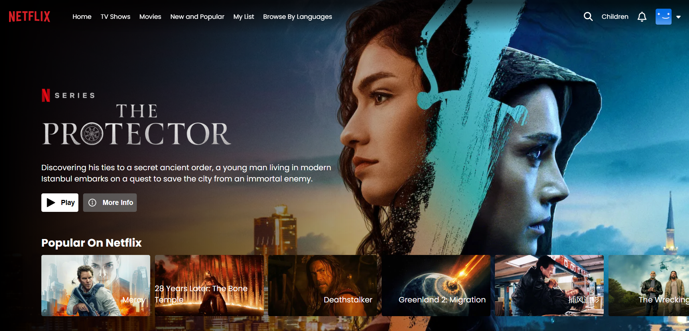
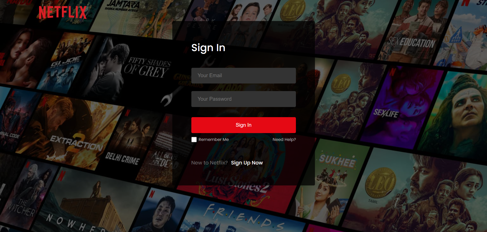
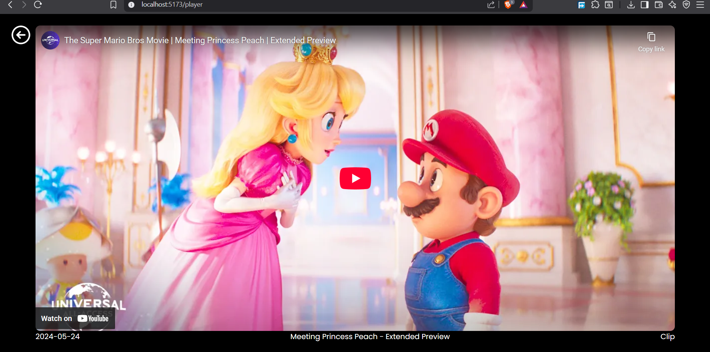

# 🎬 Netflix Clone (React + Vite)

A Netflix-inspired streaming platform UI built using React.

---

## 🚀 Features

- Responsive Netflix-style UI
- Movie cards layout
- Hero banner section
- Navbar & footer
- Routing implemented
- Player page

---

## 🛠 Tech Stack

- React
- Vite
- React Router
- CSS

---

## 📌 Project Status

✅ Frontend Completed  
🚧 Backend (Firebase Authentication & Firestore) – Coming Next

---

## 📷 Screenshots

### 🏠 Homepage

### 🔐 Login Page

### 🎬 Player Page

---

## 👨‍💻 Author

Ketan Goswami